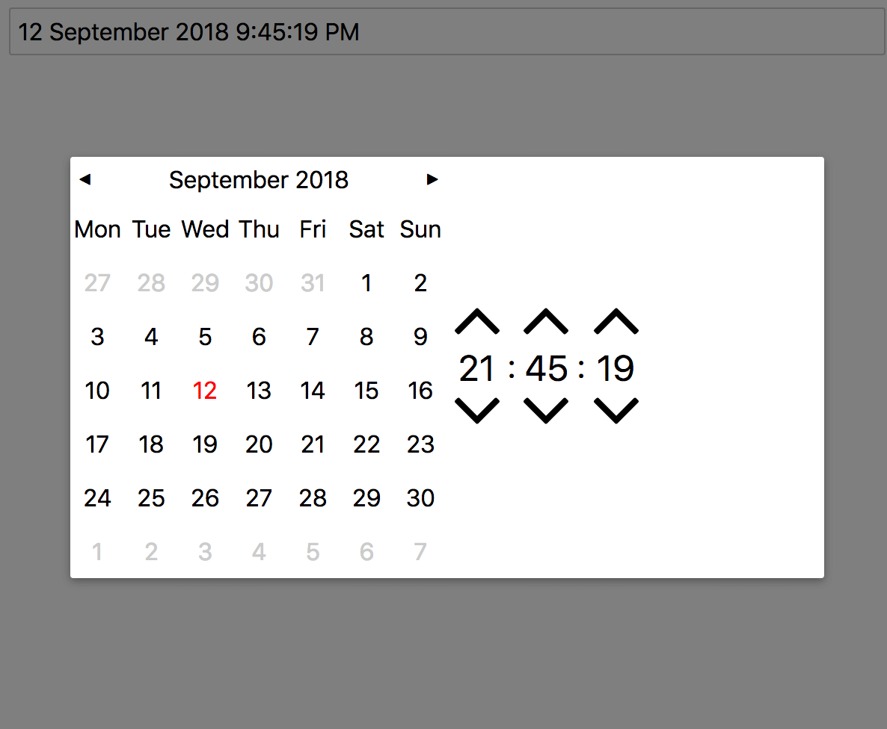

# vue-datetime-picker



## Props

```js
import en_locale from "date-fns/locale/en";
```

```js
locale: {
  type: Object,
  default() {
    return {
      days: ["Mon", "Tue", "Wed", "Thu", "Fri", "Sat", "Sun"],
      ...en_locale
    };
  }
},
format: {
  type: String,
  default: "D MMMM YYYY h:mm:ss A"
},
value: {
  type: [String, Date],
  required: true
}
```

## Usage

```js
import DateTimePicker from "vue-datetime-picker";
import 'vue-datetime-picker/dist/VueDateTimePicker.css';

...
components: {
  DateTimePicker
},
data() {
  return {
    datetime: new Date()
  };
},
watch: {
  datetime(value) {
    console.log(value);
  }
}
...
```

```html
<date-time-picker v-model="datetime"></date-time-picker>
```
